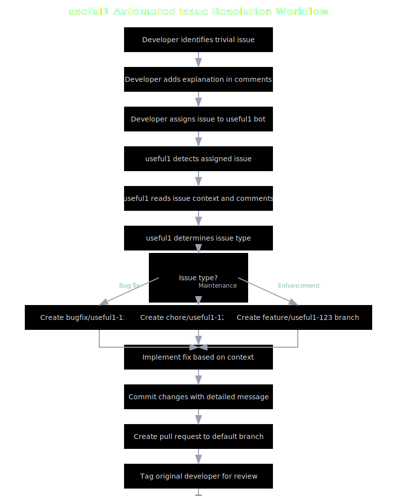

# useful1: Automated GitHub Issue Resolution System

`useful1` is a powerful automation tool that takes GitHub issue resolution to the next level. When developers identify trivial or straightforward issues, they can assign them to useful1, which will automatically read the context, implement a fix, create a branch, and submit a pull request—transforming issue discussions into code contributions without manual intervention.

## Core Concepts

### The Problem We're Solving

Development teams regularly encounter issues that:
1. Are trivial or straightforward to fix
2. Have clear solutions already identified in comments
3. Require standard, repeatable implementation patterns
4. Take valuable developer time away from more complex tasks

These issues create unnecessary context-switching for developers and slow down the overall development process, despite having well-understood solutions.

### Our Solution

`useful1` transforms issue resolution by:

1. **Monitoring repositories** for issues assigned to it
2. **Reading the full context** including issue description and all comments
3. **Understanding the requested fix** from developer explanations
4. **Automatically implementing changes** by creating a new branch
5. **Submitting a pull request** with the implemented fix
6. **Notifying the original developer** for review

This automated workflow converts issue discussions directly into code changes, dramatically reducing the overhead for routine fixes.

## Workflow Diagram

The following diagram illustrates the complete workflow of useful1:



## Project Structure

The project follows a modular Go architecture with clear separation of concerns:

```
useful1/
├── cmd/
│   └── useful1/
│       └── main.go         # Entry point and command-line interface
├── internal/
│   ├── auth/
│   │   └── auth.go         # Authentication for GitHub and Anthropic
│   ├── budget/
│   │   └── budget.go       # Budget management for API usage
│   ├── cli/
│   │   └── executor.go     # Executes the wrapped CLI tool
│   ├── config/
│   │   └── config.go       # Configuration management
│   ├── github/
│   │   ├── client.go       # GitHub API client
│   │   └── monitor.go      # Issue monitoring system
│   └── monitoring/
│       └── setup.go        # Monitoring configuration
├── Dockerfile              # Container definition
├── docker-compose.yml      # Container orchestration
├── go.mod                  # Go module definition
└── Makefile                # Build and development commands
```

### Key Components

#### 1. Command-Line Interface (cmd/useful1/main.go)

The main entry point that provides these commands:
- `config`: Interactive setup for authentication and preferences
- `monitor`: Continuous monitoring for assigned issues
- `respond`: Manual response to specific issues
- `pr`: Create pull requests
- `test`: Run tests through the CLI tool

#### 2. Configuration Manager (internal/config/config.go)

Handles loading, saving, and validating application settings, stored in `~/.useful1/config.yaml`.

#### 3. GitHub Client (internal/github/client.go)

Provides a clean interface to the GitHub API for repository operations, branch creation, and PR submission.

#### 4. Issue Monitor (internal/github/monitor.go)

The heart of the system, continuously checking for issues assigned to the bot and initiating the resolution workflow.

#### 5. CLI Executor (internal/cli/executor.go)

Bridges GitHub and your CLI tool, handling execution, code generation, and repository interactions.

#### 6. Authentication (internal/auth/auth.go)

Manages GitHub and Anthropic authentication through interactive setup.

#### 7. Budget Management (internal/budget/budget.go)

Controls API usage costs by setting and enforcing budget limits.

## Installation

### Prerequisites

- Go 1.22 or higher
- Git
- A GitHub Personal Access Token with `repo`, `workflow`, and `read:org` scopes
- An Anthropic API Key (for using Claude to understand issues and generate fixes)

### From Source

```bash
# Clone the repository
git clone https://github.com/hellausefulsoftware/useful1.git
cd useful1

# Build the binary
make build

# The binary will be in ./bin/useful1
```


## Configuration

Before using `useful1`, run the interactive configuration:

```bash
./bin/useful1 config
```

The configuration process will guide you through:

1. **GitHub Authentication**: Setting up your GitHub token
2. **Anthropic Authentication**: Configuring your Anthropic API key
3. **Budget Configuration**: Setting spending limits for different operations
4. **Monitoring Settings**: Configuring which repositories to monitor
5. **CLI Tool Configuration**: Specifying the path to your CLI tool

All settings are stored in `~/.useful1/config.yaml` for future use.

## Example Implementation Workflow

Here's a concrete example of how useful1 resolves an issue:

### 1. Original Issue

```
Title: Button color inconsistency in dark mode
#42

The primary button in the header maintains its light blue color even when dark mode is active.
This causes poor contrast and accessibility issues.

According to our design system, primary buttons should change to a darker blue (#1a56e8) in dark mode.
```

### 2. Developer Comment

```
@devleader:
This is a simple CSS fix. We need to modify the ThemeProvider component to apply the correct color
in dark mode. The button class should have its color changed to #1a56e8 when the theme is set to dark.
This can be found in src/components/ThemeProvider.tsx.

Assigning to @useful1 to implement this fix.
```

### 3. Bot Takes Action

useful1 automatically:
- Creates a branch: `bugfix/useful1-42`
- Modifies the ThemeProvider.tsx file to update the color
- Commits with a detailed message
- Creates a PR referencing the issue
- Tags the developer for review
- Comments on the original issue with a link to the PR

For the complete workflow with code examples, check out our [example implementation workflow](docs/example-workflow.md).

## Usage

### Monitoring for Assigned Issues

Start the continuous monitoring process:

```bash
./bin/useful1 monitor
```

This will:
- Check for GitHub issues assigned to the bot
- Process each issue by reading the context and understanding the requested fix
- Create a new branch following the naming convention: `bugfix|chore|feature/useful1-[issue-number]`
- Implement the necessary changes
- Create a pull request with the changes
- Tag the original assignor for review
- Comment on the issue with a link to the PR

For a one-time check:

```bash
./bin/useful1 monitor --once
```

### Manual Issue Processing

Process a specific issue:

```bash
./bin/useful1 respond 123 --implement
```

Where `123` is the issue number and `--implement` flag triggers the fix implementation.

### Creating Pull Requests Manually

```bash
./bin/useful1 pr feature-branch "New feature implementation"
```

### Running Tests

```bash
./bin/useful1 test integration
```

## Technical Implementation

### Issue Resolution Workflow

1. The monitor identifies issues assigned to the bot
2. For each assigned issue, it:
   - Retrieves the full issue details including all comments
   - Analyzes the context to understand the required fix
   - Determines the appropriate branch type (bugfix, chore, feature)
   - Creates a new branch from the repository's default branch
   - Implements the necessary changes using the CLI tool
   - Commits the changes with a detailed commit message
   - Creates a pull request targeting the default branch
   - Tags the original assignor for review
   - Comments on the issue with a link to the PR

### Branch Naming Convention

The system follows a strict branch naming convention:
```
[type]/useful1-[issue-number]
```

Where `[type]` is one of:
- `bugfix` for bug fixes
- `chore` for maintenance tasks
- `feature` for new features

This convention ensures consistency and traceability between issues and PRs.

### Pull Request Creation

Pull requests created by the bot include:
- A title referencing the original issue
- A detailed description of the changes made
- A reference to the issue being fixed
- Proper tags for the original assignor to review

### CLI Tool Integration

Your CLI tool should accept these arguments for implementing fixes:
```
implement --issue-file /path/to/issue.txt --owner repo-owner --repo repo-name --number 123 --branch bugfix/useful1-123
```

The issue file contains the full context of the issue, allowing the tool to understand the required changes.

## Contributing

Contributions are welcome! Please feel free to submit a Pull Request.

## License

This project is licensed under the MIT License - see the LICENSE file for details.